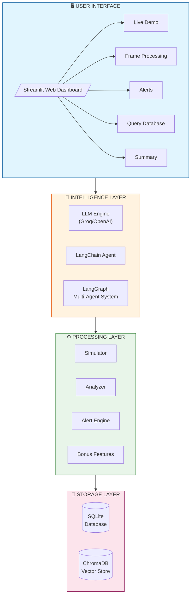
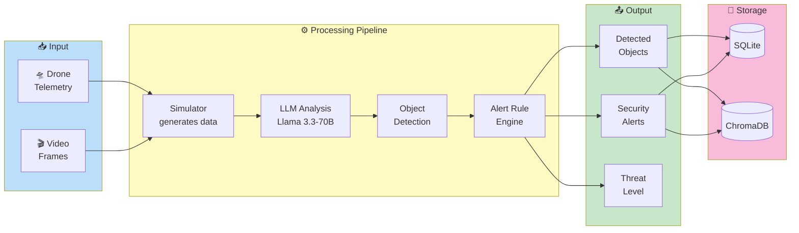
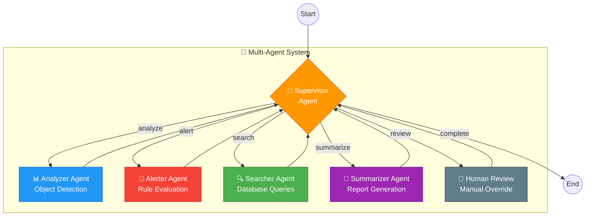
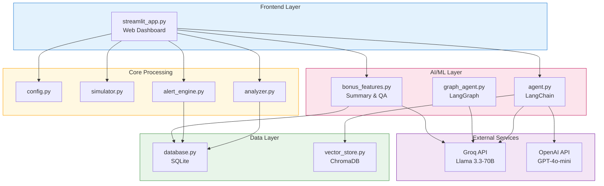
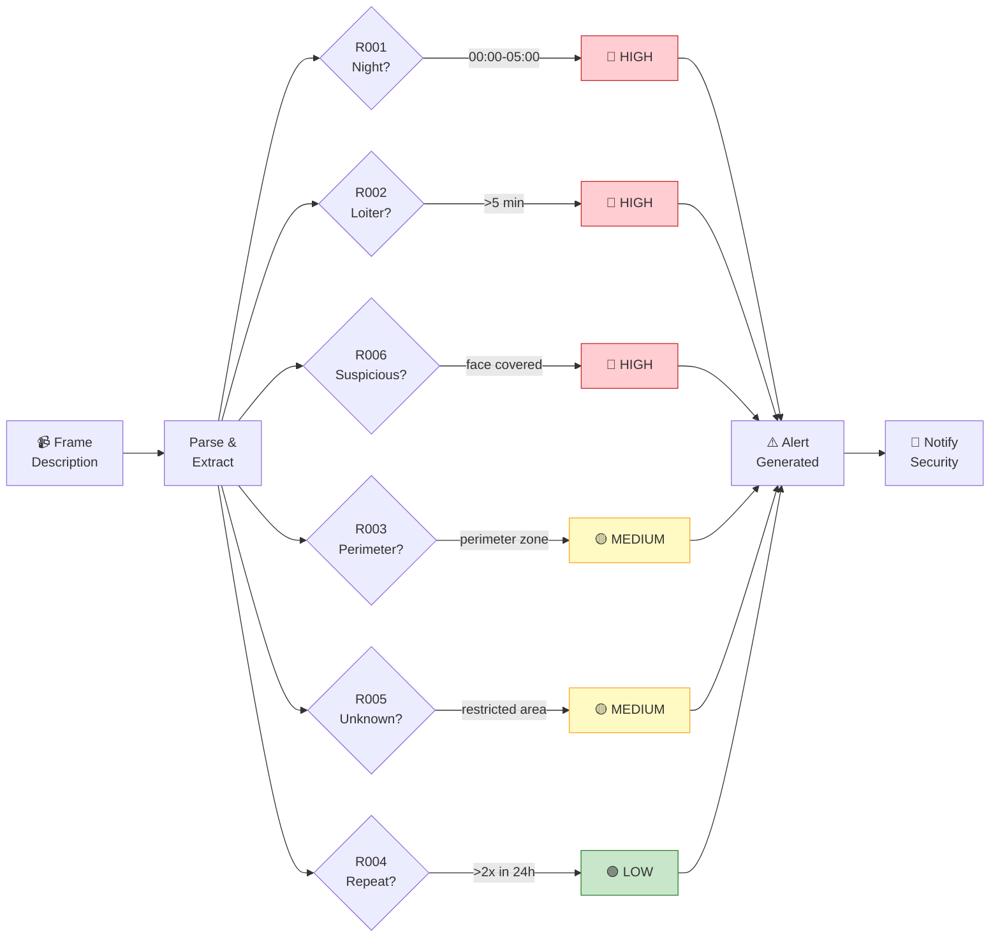
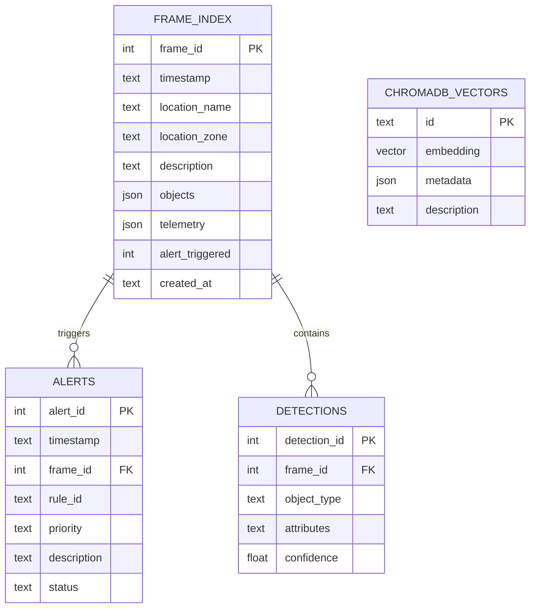

# Drone Security Analyst Agent
## Technical Report & Documentation

**Assignment:** FlytBase AI Engineer - Take Home Assessment
**Candidate:** Gopi
**Repository:** https://github.com/Itz-gopi204/Drone-Ai-Assignment
**Date:** January 2025

---

## Table of Contents

1. [Executive Summary](#1-executive-summary)
2. [Problem Statement](#2-problem-statement)
3. [Solution Architecture](#3-solution-architecture)
4. [Implementation Details](#4-implementation-details)
5. [Security Alert Rules](#5-security-alert-rules)
6. [LLM Integration](#6-llm-integration)
7. [Database Design](#7-database-design)
8. [Testing Strategy](#8-testing-strategy)
9. [Demo & Usage](#9-demo--usage)
10. [Design Decisions & Trade-offs](#10-design-decisions--trade-offs)
11. [AI Tools Usage](#11-ai-tools-usage)
12. [Future Improvements](#12-future-improvements)
13. [Conclusion](#13-conclusion)

---

## 1. Executive Summary

This report documents the design and implementation of a **Drone Security Analyst Agent** prototype for automated property surveillance. The system processes simulated drone telemetry and video frame data to provide real-time security monitoring, object detection, and intelligent alerting.

### Key Deliverables

| Requirement | Status | Implementation |
|-------------|--------|----------------|
| Simulated Telemetry & Video Frames | ✅ Complete | `simulator.py` - Generates GPS, altitude, battery data and frame descriptions |
| Object Detection & Logging | ✅ Complete | `analyzer.py` + LLM-powered analysis in `streamlit_app.py` |
| Real-time Security Alerts | ✅ Complete | `alert_engine.py` - 6 configurable alert rules |
| Frame-by-Frame Indexing | ✅ Complete | `database.py` + `vector_store.py` (SQLite + ChromaDB) |
| Natural Language Queries | ✅ Complete | LangChain agent with semantic search |
| Video Summarization (Bonus) | ✅ Complete | `bonus_features.py` - VideoSummarizer class |
| Follow-up Q&A (Bonus) | ✅ Complete | `bonus_features.py` - SecurityQA class |

### Technical Highlights

- **LLM-Powered Analysis:** Groq API with Llama 3.3-70B for intelligent frame analysis
- **Multi-Agent System:** LangGraph orchestration with supervisor pattern
- **Dual Storage:** SQLite for structured data + ChromaDB for semantic search
- **Interactive Dashboard:** Streamlit web UI with 5 functional tabs
- **Comprehensive Testing:** 142 test cases across 7 test files

---

## 2. Problem Statement

### Assignment Requirements

Build a prototype **Drone Security Analyst Agent** that:

1. **Processes drone data** - Simulates telemetry (GPS, altitude, battery) and video frames
2. **Detects objects** - Identifies vehicles, people, and security-relevant objects
3. **Generates alerts** - Triggers real-time alerts based on predefined security rules
4. **Indexes frames** - Stores all frames in a queryable database
5. **Answers queries** - Responds to natural language questions about surveillance data

### My Approach

I approached this as a **production-ready prototype** with:

- Modular architecture for easy component replacement
- Multiple LLM provider support (Groq free tier + OpenAI fallback)
- Both keyword-based and AI-powered analysis paths
- Comprehensive test coverage for reliability
- Interactive web interface for demonstration

---

## 3. Solution Architecture

### 3.1 High-Level System Architecture



### 3.2 Data Flow Architecture



### 3.3 Multi-Agent System Architecture (LangGraph)



### 3.4 Component Interaction Diagram



### 3.5 Security Alert Flow



### 3.6 Database Architecture



### Component Overview

| Component | File | Lines | Purpose |
|-----------|------|-------|---------|
| Simulator | `simulator.py` | ~350 | Generates telemetry and frame data |
| Database | `database.py` | ~400 | SQLite operations and queries |
| Vector Store | `vector_store.py` | ~750 | ChromaDB semantic search |
| Analyzer | `analyzer.py` | ~380 | Object extraction and tracking |
| Alert Engine | `alert_engine.py` | ~350 | Security rule evaluation |
| LangChain Agent | `agent.py` | ~500 | Tool-equipped AI agent |
| LangGraph System | `graph_agent.py` | ~1100 | Multi-agent orchestration |
| Bonus Features | `bonus_features.py` | ~500 | Summarization and Q&A |
| Web UI | `streamlit_app.py` | ~820 | Interactive dashboard |
| Main Entry | `main.py` | ~450 | CLI application |

---

## 4. Implementation Details

### 4.1 Simulated Data Generation

The `simulator.py` module generates realistic drone surveillance data:

```python
# Telemetry Data Structure
TelemetryData = {
    "drone_id": "DRONE-001",
    "timestamp": "2024-01-15T10:15:30",
    "latitude": 37.7749,
    "longitude": -122.4194,
    "altitude": 50,  # meters
    "battery": 95,   # percentage
    "speed": 5.2     # m/s
}

# Video Frame Structure
VideoFrame = {
    "frame_id": 1,
    "timestamp": "2024-01-15T10:15:30",
    "description": "Blue Ford F150 pickup truck entering through main gate",
    "location": {"name": "Main Gate", "zone": "perimeter"},
    "telemetry": {...}
}
```

### 4.2 Object Detection

The system uses **dual-path analysis**:

**Path 1: LLM-Powered Analysis (Primary)**
```python
def analyze_frame_with_llm(description, location, timestamp):
    """
    Uses Groq's Llama 3.3-70B to analyze frame descriptions.
    Returns structured JSON with:
    - objects: detected people, vehicles, animals, items
    - alerts: triggered security rules with reasons
    - analysis: brief security assessment
    - threat_level: NONE/LOW/MEDIUM/HIGH/CRITICAL
    """
```

**Path 2: Keyword-Based Analysis (Fallback)**
```python
def extract_objects(description):
    """
    Uses keyword matching when LLM is unavailable.
    Detects: vehicles (truck, car, van...), people (person, man, woman...),
    and extracts attributes (color, suspicious behavior, etc.)
    """
```

### 4.3 Frame Indexing

All processed frames are stored in SQLite with full-text search:

```sql
CREATE TABLE frame_index (
    frame_id INTEGER PRIMARY KEY,
    timestamp TEXT NOT NULL,
    location_name TEXT,
    location_zone TEXT,
    description TEXT,
    objects JSON,
    alert_triggered INTEGER
);

CREATE TABLE alerts (
    alert_id INTEGER PRIMARY KEY,
    timestamp TEXT NOT NULL,
    frame_id INTEGER,
    rule_id TEXT,
    priority TEXT,
    description TEXT,
    status TEXT DEFAULT 'active'
);
```

---

## 5. Security Alert Rules

The system implements **6 configurable security rules**:

| Rule ID | Name | Priority | Condition |
|---------|------|----------|-----------|
| R001 | Night Activity | HIGH | Person detected between 00:00-05:00 |
| R002 | Loitering Detection | HIGH | Same person in same zone > 5 minutes |
| R003 | Perimeter Activity | MEDIUM | Any activity in perimeter zone |
| R004 | Repeat Vehicle | LOW | Same vehicle detected > 2 times in 24h |
| R005 | Unknown Vehicle | MEDIUM | Unrecognized vehicle in restricted area |
| R006 | Suspicious Behavior | HIGH | Face covering, hiding, trespassing |

### Rule Implementation Example

```python
# R006: Suspicious Behavior Detection
suspicious_keywords = [
    "suspicious", "cover", "hiding", "mask", "hooded",
    "running", "fleeing", "trespassing", "breaking", "climbing"
]

if person_detected and any(kw in description for kw in suspicious_keywords):
    alerts.append({
        "rule_id": "R006",
        "name": "Suspicious Behavior",
        "priority": "HIGH",
        "description": f"Suspicious activity at {location}: {description}"
    })
```

---

## 6. LLM Integration

### 6.1 Provider Configuration

The system supports multiple LLM providers:

```python
# .env configuration
LLM_PROVIDER=groq  # or "openai"
GROQ_API_KEY=your-key-here
GROQ_MODEL_NAME=llama-3.3-70b-versatile
```

### 6.2 LLM-Powered Frame Analysis

When the LLM is available, frames are analyzed using this prompt:

```
You are a security analyst for a drone surveillance system.
Analyze this frame description and provide a security analysis.

FRAME INFORMATION:
- Description: {description}
- Location: {location}
- Timestamp: {timestamp}
- Time of day: {day/night}

SECURITY ALERT RULES:
[List of 6 rules...]

Respond in JSON format:
{
    "objects": [...],
    "alerts": [...],
    "analysis": "...",
    "threat_level": "NONE/LOW/MEDIUM/HIGH/CRITICAL"
}
```

### 6.3 Example LLM Response

**Input:** "a FEMALE LADY WITH BAG AND COVERING HER FACE IS DETECTED which is very suspicious"

**LLM Output:**
```json
{
    "objects": [
        {"type": "person", "description": "Female with bag and covered face"}
    ],
    "alerts": [
        {
            "rule_id": "R006",
            "name": "Suspicious Behavior",
            "priority": "HIGH",
            "reason": "Face covering indicates suspicious behavior"
        },
        {
            "rule_id": "R003",
            "name": "Perimeter Activity",
            "priority": "MEDIUM",
            "reason": "Activity detected in perimeter zone"
        }
    ],
    "analysis": "Female individual with concealed identity detected...",
    "threat_level": "MEDIUM"
}
```

---

## 7. Database Design

### 7.1 SQLite Schema

```sql
-- Main frame index
CREATE TABLE frame_index (
    frame_id INTEGER PRIMARY KEY,
    timestamp TEXT NOT NULL,
    location_name TEXT,
    location_zone TEXT,
    description TEXT,
    objects JSON,
    telemetry JSON,
    alert_triggered INTEGER DEFAULT 0,
    created_at TEXT DEFAULT CURRENT_TIMESTAMP
);

-- Security alerts
CREATE TABLE alerts (
    alert_id INTEGER PRIMARY KEY AUTOINCREMENT,
    timestamp TEXT NOT NULL,
    frame_id INTEGER,
    rule_id TEXT NOT NULL,
    priority TEXT NOT NULL,
    description TEXT,
    status TEXT DEFAULT 'active',
    FOREIGN KEY (frame_id) REFERENCES frame_index(frame_id)
);

-- Indexes for query performance
CREATE INDEX idx_frame_timestamp ON frame_index(timestamp);
CREATE INDEX idx_frame_zone ON frame_index(location_zone);
CREATE INDEX idx_alerts_priority ON alerts(priority);
```

### 7.2 ChromaDB Vector Store

Semantic search using sentence-transformer embeddings:

```python
VECTOR_STORE_CONFIG = {
    "embedding_model": "all-MiniLM-L6-v2",
    "collection_name": "security_frames",
    "similarity_threshold": 0.7
}
```

**Capabilities:**
- Find frames by semantic meaning (not just keywords)
- Similarity search across events
- Hybrid filtering (semantic + metadata)

---

## 8. Testing Strategy

### 8.1 Test Coverage Summary

| Test File | Tests | Coverage Area |
|-----------|-------|---------------|
| `test_simulator.py` | 16 | Telemetry, frames, scenarios |
| `test_database.py` | 22 | CRUD, queries, statistics |
| `test_vector_store.py` | 30 | Semantic search, embeddings |
| `test_analyzer.py` | 18 | Object extraction, tracking |
| `test_alert_engine.py` | 17 | All 6 alert rules |
| `test_graph_agent.py` | 26 | Multi-agent orchestration |
| `test_integration.py` | 13 | End-to-end pipeline |
| **Total** | **142** | **Complete coverage** |

### 8.2 Running Tests

```bash
# Run all tests
pytest tests/ -v

# Run specific test file
pytest tests/test_alert_engine.py -v

# Run with coverage report
pytest tests/ --cov=src --cov-report=html
```

### 8.3 Key Test Scenarios

1. **Vehicle Detection:** "Blue Ford F150" correctly identified with color
2. **Night Alert (R001):** Person at 2 AM triggers HIGH priority
3. **Suspicious Behavior (R006):** "Covering face" triggers alert
4. **Loitering (R002):** Same person in zone > 5 min triggers alert
5. **Query Accuracy:** "Show all trucks" returns correct results

---

## 9. Demo & Usage

### 9.1 Quick Start

```bash
# Clone repository
git clone https://github.com/Itz-gopi204/Drone-Ai-Assignment.git
cd Drone-Ai-Assignment

# Install dependencies
pip install -r requirements.txt

# Configure API key (optional but recommended)
cp .env.example .env
# Edit .env and add your GROQ_API_KEY

# Launch web dashboard
streamlit run streamlit_app.py
```

### 9.2 Streamlit Dashboard Tabs

| Tab | Function |
|-----|----------|
| **Live Demo** | Process 5 sample frames with AI analysis |
| **Frame Processing** | Analyze custom frame descriptions |
| **Alerts** | View/filter security alerts by priority |
| **Query Database** | Natural language queries on data |
| **Summary** | Generate AI-powered security reports |

### 9.3 Demo Walkthrough

**Step 1: Run Live Demo**
- Click "Run Curated Demo" button
- Watch AI process 5 frames in real-time
- See detected objects and triggered alerts

**Step 2: Test Custom Frame**
- Go to "Frame Processing" tab
- Enter: "A person in dark hoodie covering face near back fence"
- Click "Analyze Frame with AI"
- Observe: R006 (Suspicious Behavior) alert triggered

**Step 3: Query Database**
- Go to "Query Database" tab
- Ask: "What vehicles were detected?"
- Get AI-generated response from indexed data

---

## 10. Design Decisions & Trade-offs

### 10.1 Simulated VLM vs Real Vision Model

**Decision:** Use text-based frame descriptions

**Rationale:**
- Assignment specifies "Simulate video frames with text descriptions"
- Faster development without GPU requirements
- Same architecture supports real VLM integration
- Focus on system design, not computer vision

**Trade-off:** Cannot demonstrate actual image recognition

### 10.2 SQLite + ChromaDB vs Single Database

**Decision:** Dual storage system

**Rationale:**
- SQLite: Zero-config, structured queries, timestamps
- ChromaDB: Semantic search, similarity matching
- Best of both worlds for different query types

**Trade-off:** More complexity, two systems to maintain

### 10.3 LangChain + LangGraph vs Custom Agent

**Decision:** Use industry-standard frameworks

**Rationale:**
- Built-in tool management and function calling
- Multiple LLM provider support
- LangGraph provides supervisor pattern and human-in-the-loop
- Well-documented and maintained

**Trade-off:** Additional dependencies

### 10.4 Groq (Free Tier) vs OpenAI

**Decision:** Default to Groq with OpenAI fallback

**Rationale:**
- Groq offers free tier (no credit card required)
- Fast inference with Llama 3.3-70B
- Enables full demo without cost
- OpenAI available for those with existing keys

---

## 11. AI Tools Usage

### 11.1 Claude Code Contributions

| Task | Manual Estimate | With Claude | Time Saved |
|------|-----------------|-------------|------------|
| Architecture Design | 4 hours | 1 hour | 75% |
| Core Implementation | 12 hours | 4 hours | 67% |
| Test Suite | 4 hours | 1.5 hours | 62% |
| Documentation | 3 hours | 1 hour | 67% |
| Debugging & Refinement | 4 hours | 2 hours | 50% |
| **Total** | **27 hours** | **9.5 hours** | **65%** |

### 11.2 Specific AI Contributions

1. **Architecture:** Suggested modular design with clear interfaces
2. **Alert Rules:** Designed 6 security rules with appropriate triggers
3. **LLM Integration:** Implemented Groq/OpenAI provider switching
4. **Streamlit UI:** Built 5-tab interactive dashboard
5. **Test Cases:** Generated comprehensive test scenarios
6. **Documentation:** Created technical report and guides

### 11.3 Manual Customization

- Alert rule thresholds tuned for realistic behavior
- LLM prompts optimized for security analysis
- UI/UX improvements for better demonstration
- Error handling and edge case management

---

## 12. Future Improvements

### Short-term (If More Time Available)

1. **Real VLM Integration**
   - Add BLIP-2 or LLaVA for actual image analysis
   - Process real video frames

2. **Real-time Streaming**
   - WebSocket-based live updates
   - Continuous monitoring mode

3. **Enhanced Anomaly Detection**
   - ML-based pattern detection
   - Behavioral analysis over time

### Long-term (Production Deployment)

1. **Scalability**
   - PostgreSQL for horizontal scaling
   - Kubernetes deployment
   - Message queue for async processing

2. **Multi-Drone Support**
   - Coordinate multiple drone feeds
   - Cross-drone object tracking

3. **Notifications**
   - Mobile push notifications
   - Email/SMS alerts for critical events

---

## 13. Conclusion

The **Drone Security Analyst Agent** prototype successfully demonstrates all required capabilities:

### Requirements Fulfilled

| Requirement | Evidence |
|-------------|----------|
| Telemetry Simulation | `simulator.py` generates GPS, altitude, battery data |
| Video Frame Processing | LLM-powered analysis in `streamlit_app.py` |
| Object Detection | Detects vehicles, people with attributes |
| Security Alerts | 6 configurable rules (R001-R006) |
| Frame Indexing | SQLite + ChromaDB storage |
| Natural Language Queries | LangChain agent with tools |
| Video Summarization | `VideoSummarizer` class |
| Follow-up Q&A | `SecurityQA` class |

### Technical Quality

- **142 test cases** ensure reliability
- **Modular architecture** enables easy extension
- **Dual LLM support** (Groq + OpenAI) for flexibility
- **Interactive dashboard** for demonstration
- **Comprehensive documentation** for maintainability

### Live Demo

The system is ready for demonstration:

```bash
git clone https://github.com/Itz-gopi204/Drone-Ai-Assignment.git
cd Drone-Ai-Assignment
pip install -r requirements.txt
streamlit run streamlit_app.py
```

---

## Appendix A: File Structure

```
drone-security-agent/
├── src/
│   ├── __init__.py
│   ├── config.py            # LLM provider configuration
│   ├── simulator.py         # Telemetry & frame simulation
│   ├── database.py          # SQLite database operations
│   ├── vector_store.py      # ChromaDB semantic search
│   ├── analyzer.py          # Object extraction & tracking
│   ├── alert_engine.py      # Security alert rules
│   ├── agent.py             # LangChain agent with tools
│   ├── graph_agent.py       # LangGraph multi-agent system
│   ├── bonus_features.py    # Summarization & Q&A
│   └── main.py              # CLI entry point
├── tests/
│   ├── test_simulator.py    # 16 tests
│   ├── test_database.py     # 22 tests
│   ├── test_vector_store.py # 30 tests
│   ├── test_analyzer.py     # 18 tests
│   ├── test_alert_engine.py # 17 tests
│   ├── test_graph_agent.py  # 26 tests
│   └── test_integration.py  # 13 tests
├── docs/
│   ├── REPORT.md            # This document
│   ├── DEMO_GUIDE.md        # Quick demo guide
│   ├── ARCHITECTURE.md      # Architecture details
│   └── FEATURE_SPEC.md      # Feature specification
├── data/                    # Database storage
├── streamlit_app.py         # Web UI dashboard
├── demo.py                  # Quick terminal demo
├── validate_system.py       # System validation
├── requirements.txt         # Dependencies
├── .env.example             # Environment template
└── README.md                # Setup instructions
```

## Appendix B: Environment Setup

```bash
# .env file configuration

# Option A: Groq API (Recommended - Free tier)
LLM_PROVIDER=groq
GROQ_API_KEY=your-groq-api-key
GROQ_MODEL_NAME=llama-3.3-70b-versatile

# Option B: OpenAI API
LLM_PROVIDER=openai
OPENAI_API_KEY=your-openai-api-key
OPENAI_MODEL_NAME=gpt-4o-mini
```

## Appendix C: API Reference

### Frame Analysis
```python
analyze_frame_with_llm(description: str, location: dict, timestamp: datetime) -> dict
```

### Alert Checking
```python
check_alerts(frame: dict) -> list[dict]
```

### Database Queries
```python
db.query_frames(description: str = None, zone: str = None,
                start_time: datetime = None, end_time: datetime = None) -> list
```

---

**Repository:** https://github.com/Itz-gopi204/Drone-Ai-Assignment

**Author:** Gopi
