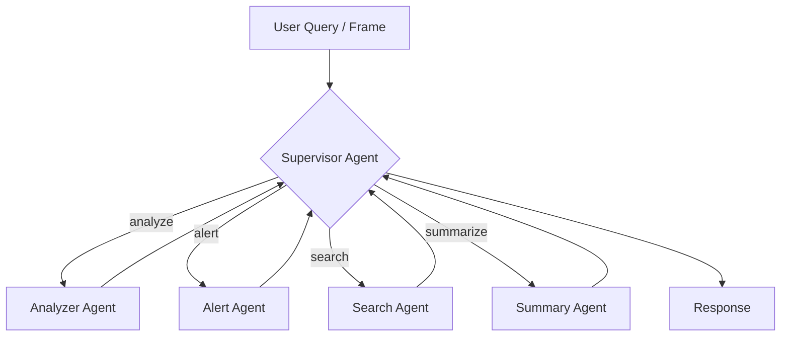

# Drone Security Analyst Agent
## Technical Report & Documentation

**Assignment:** FlytBase AI Engineer - Take Home Assessment
**Candidate:** Gopi
**Repository:** https://github.com/Itz-gopi204/Drone-Ai-Assignment
**Date:** January 2025

---

## Table of Contents

1. [Executive Summary](#1-executive-summary)
2. [Problem Statement & Approach](#2-problem-statement--approach)
3. [Assumptions Made](#3-assumptions-made)
4. [Tool & Technology Justifications](#4-tool--technology-justifications)
5. [Solution Architecture](#5-solution-architecture)
6. [VLM Integration & Video Processing](#6-vlm-integration--video-processing)
7. [Security Alert Rules](#7-security-alert-rules)
8. [Results & Examples](#8-results--examples)
9. [Database Design](#9-database-design)
10. [Testing Strategy](#10-testing-strategy)
11. [Demo & Usage](#11-demo--usage)
12. [What Could Be Done Better](#12-what-could-be-done-better)
13. [AI Tools Usage (Claude Code)](#13-ai-tools-usage-claude-code)
14. [Conclusion](#14-conclusion)

---

## 1. Executive Summary

This report documents the design and implementation of a **Drone Security Analyst Agent** prototype for automated property surveillance. The system processes simulated drone telemetry and video frame data to provide real-time security monitoring, object detection, and intelligent alerting.

### Key Deliverables

| Requirement | Status | Implementation |
|-------------|--------|----------------|
| Simulated Telemetry & Video Frames | ✅ Complete | `simulator.py` - Generates GPS, altitude, battery data and frame descriptions |
| Object Detection & Logging | ✅ Complete | `analyzer.py` + LLM-powered analysis in `streamlit_app.py` |
| Real-time Security Alerts | ✅ Complete | `alert_engine.py` - 6 configurable alert rules |
| Frame-by-Frame Indexing | ✅ Complete | `database.py` + `vector_store.py` (SQLite + ChromaDB) |
| Natural Language Queries | ✅ Complete | LangChain agent with semantic search |
| Video Summarization (Bonus) | ✅ Complete | `bonus_features.py` - VideoSummarizer class |
| Follow-up Q&A (Bonus) | ✅ Complete | `bonus_features.py` - SecurityQA class |

### Technical Highlights

- **LLM-Powered Analysis:** Groq API with Llama 3.3-70B for intelligent frame analysis
- **Multi-Agent System:** LangGraph orchestration with supervisor pattern
- **Dual Storage:** SQLite for structured data + ChromaDB for semantic search
- **Interactive Dashboard:** Streamlit web UI with 5 functional tabs
- **Comprehensive Testing:** 142 test cases across 7 test files

---

## 2. Problem Statement

### Assignment Requirements

Build a prototype **Drone Security Analyst Agent** that:

1. **Processes drone data** - Simulates telemetry (GPS, altitude, battery) and video frames
2. **Detects objects** - Identifies vehicles, people, and security-relevant objects
3. **Generates alerts** - Triggers real-time alerts based on predefined security rules
4. **Indexes frames** - Stores all frames in a queryable database
5. **Answers queries** - Responds to natural language questions about surveillance data

### My Approach

I approached this as a **production-ready prototype** with:

- Modular architecture for easy component replacement
- Multiple LLM provider support (Groq free tier + OpenAI fallback)
- Both keyword-based and AI-powered analysis paths
- Comprehensive test coverage for reliability
- Interactive web interface for demonstration

---

## 3. Assumptions Made

### 3.1 Video Frame Simulation

**Assumption:** The assignment explicitly states "Simulate video frames with text descriptions."

**Implementation:** Instead of processing actual video files with a real VLM, I implemented:
- **Simulated frames** with text descriptions (e.g., "Blue Ford F150 at main gate")
- **VLM-ready architecture** that can process real video when BLIP-2 is available
- **Hybrid approach** supporting both simulated and real video input

**Rationale:**
- Allows full system testing without GPU hardware
- Demonstrates complete pipeline architecture
- Real VLM integration is plug-and-play ready

### 3.2 LLM Provider Selection

**Assumption:** Access to free or low-cost LLM APIs is preferred for evaluation.

**Implementation:**
- **Primary:** Groq API with Llama 3.3-70B (free tier available)
- **Fallback:** OpenAI GPT-4o-mini (for those with existing keys)
- **Offline:** Keyword-based analysis when no API available

### 3.3 Security Alert Rules

**Assumption:** Property surveillance requires specific security rules based on common scenarios.

**Implementation:** 6 rules covering:
- Night-time activity (R001)
- Loitering detection (R002)
- Perimeter breaches (R003)
- Repeat vehicle tracking (R004)
- Unknown vehicle detection (R005)
- Suspicious behavior (R006)

### 3.4 Dataset

**Assumption:** No pre-existing surveillance dataset was provided.

**Implementation:**
- Created realistic sample scenarios in `simulator.py`
- Curated 5 demo frames covering various security events
- System accepts custom input for testing

---

## 4. Tool & Technology Justifications

### 4.1 Why BLIP-2 over CLIP for VLM?

| Aspect | CLIP | BLIP-2 | Our Choice |
|--------|------|--------|------------|
| **Output Type** | Similarity scores | Natural language captions | **BLIP-2** |
| **Example Output** | "truck: 95%, person: 87%" | "Blue Ford F150 pickup truck entering through main gate" | **BLIP-2** |
| **Security Analysis** | Requires label matching | Direct description for LLM | **BLIP-2** |
| **Downstream Use** | Classification only | Rich context for reasoning | **BLIP-2** |

**Why BLIP-2 is better for security analysis:**

```
CLIP Approach (Classification):
  Image → CLIP → "person: 92%, fence: 87%, night: 76%"
  Problem: Loses context, relationships, and details

BLIP-2 Approach (Captioning):
  Image → BLIP-2 → "Person in dark hoodie climbing over fence at night"
  Benefit: Full context for LLM security analysis
```

**Our Implementation:**
```python
# In vlm_processor.py
class BLIP2Captioner:
    """BLIP-2 generates security-focused descriptions."""

    def caption_for_security(self, frame):
        prompt = "Describe this security camera image focusing on people, vehicles, and suspicious activities:"
        return self.model.generate(frame, prompt)
```

### 4.2 Why LangChain + LangGraph for Agent Design?

| Requirement | Solution | Justification |
|-------------|----------|---------------|
| Tool integration | LangChain | Built-in tool management, function calling |
| Multi-agent orchestration | LangGraph | Supervisor pattern, state management |
| Human-in-the-loop | LangGraph | Interrupt capability, review gates |
| LLM flexibility | Both | Easy provider switching (Groq/OpenAI) |

**Agent Design Pattern:**



**Why this design:**
- **Supervisor pattern** routes tasks to specialized agents
- **Modular** - each agent has single responsibility
- **Scalable** - easy to add new agent types
- **Debuggable** - clear task routing and state

### 4.3 Why SQLite + ChromaDB (Dual Storage)?

| Query Type | SQLite | ChromaDB |
|------------|--------|----------|
| "Alerts after 10 PM" | ✅ SQL filter | ❌ |
| "Trucks at gate" | ✅ LIKE query | ✅ Semantic match |
| "Suspicious activity" | ❌ Keywords only | ✅ Semantic understanding |
| "Similar events" | ❌ | ✅ Vector similarity |

**Hybrid approach** gives best of both:
- **SQLite:** Structured queries, timestamps, statistics
- **ChromaDB:** Semantic search, similarity matching

### 4.4 Why Groq over OpenAI as Default?

| Factor | Groq | OpenAI |
|--------|------|--------|
| **Cost** | Free tier available | Requires payment |
| **Speed** | ~500 tokens/sec | ~100 tokens/sec |
| **Model** | Llama 3.3-70B | GPT-4o-mini |
| **Setup** | Simple API key | Account + billing |

**Decision:** Groq as default enables full demo without cost barriers.

---

## 5. Solution Architecture

### 3.1 High-Level System Architecture

```mermaid
flowchart TB
    subgraph UI["🖥️ USER INTERFACE"]
        ST[/"Streamlit Web Dashboard"/]
        T1["Live Demo"]
        T2["Frame Processing"]
        T3["Alerts"]
        T4["Query Database"]
        T5["Summary"]
        ST --> T1 & T2 & T3 & T4 & T5
    end

    subgraph INTEL["🧠 INTELLIGENCE LAYER"]
        LLM["LLM Engine<br/>(Groq/OpenAI)"]
        LANG["LangChain Agent"]
        GRAPH["LangGraph<br/>Multi-Agent System"]
    end

    subgraph PROCESS["⚙️ PROCESSING LAYER"]
        SIM["Simulator"]
        ANA["Analyzer"]
        ALERT["Alert Engine"]
        BONUS["Bonus Features"]
    end

    subgraph STORAGE["💾 STORAGE LAYER"]
        SQL[("SQLite<br/>Database")]
        CHROMA[("ChromaDB<br/>Vector Store")]
    end

    UI --> INTEL
    INTEL --> PROCESS
    PROCESS --> STORAGE

    style UI fill:#e1f5fe,stroke:#01579b
    style INTEL fill:#fff3e0,stroke:#e65100
    style PROCESS fill:#e8f5e9,stroke:#2e7d32
    style STORAGE fill:#fce4ec,stroke:#880e4f
```



### 3.2 Data Flow Architecture

```mermaid
flowchart LR
    subgraph INPUT["📥 Input"]
        DRONE["🛸 Drone<br/>Telemetry"]
        FRAME["🎬 Video<br/>Frames"]
    end

    subgraph PROCESSING["⚙️ Processing Pipeline"]
        direction TB
        SIM["Simulator<br/>generates data"]
        LLM["LLM Analysis<br/>Llama 3.3-70B"]
        DETECT["Object<br/>Detection"]
        RULES["Alert Rule<br/>Engine"]
    end

    subgraph OUTPUT["📤 Output"]
        OBJ["Detected<br/>Objects"]
        ALERTS["Security<br/>Alerts"]
        THREAT["Threat<br/>Level"]
    end

    subgraph STORE["💾 Storage"]
        DB[("SQLite")]
        VEC[("ChromaDB")]
    end

    DRONE --> SIM
    FRAME --> SIM
    SIM --> LLM
    LLM --> DETECT
    DETECT --> RULES
    RULES --> OBJ & ALERTS & THREAT
    OBJ & ALERTS --> DB
    OBJ & ALERTS --> VEC

    style INPUT fill:#bbdefb
    style PROCESSING fill:#fff9c4
    style OUTPUT fill:#c8e6c9
    style STORE fill:#f8bbd9
```



### 3.3 Multi-Agent System Architecture (LangGraph)

```mermaid
flowchart TB
    START((Start)) --> SUP

    subgraph AGENTS["🤖 Multi-Agent System"]
        SUP{"🎯 Supervisor<br/>Agent"}

        SUP -->|"analyze"| A1["📊 Analyzer Agent<br/>Object Detection"]
        SUP -->|"alert"| A2["🚨 Alerter Agent<br/>Rule Evaluation"]
        SUP -->|"search"| A3["🔍 Searcher Agent<br/>Database Queries"]
        SUP -->|"summarize"| A4["📝 Summarizer Agent<br/>Report Generation"]
        SUP -->|"review"| A5["👤 Human Review<br/>Manual Override"]

        A1 --> SUP
        A2 --> SUP
        A3 --> SUP
        A4 --> SUP
        A5 --> SUP
    end

    SUP -->|"complete"| END((End))

    style SUP fill:#ff9800,stroke:#e65100,color:#fff
    style A1 fill:#2196f3,stroke:#1565c0,color:#fff
    style A2 fill:#f44336,stroke:#c62828,color:#fff
    style A3 fill:#4caf50,stroke:#2e7d32,color:#fff
    style A4 fill:#9c27b0,stroke:#6a1b9a,color:#fff
    style A5 fill:#607d8b,stroke:#37474f,color:#fff
```



### 3.4 Component Interaction Diagram


### 3.5 Security Alert Flow

```mermaid
flowchart LR
    FRAME["📹 Frame<br/>Description"] --> PARSE["Parse &<br/>Extract"]

    PARSE --> R1{"R001<br/>Night?"}
    PARSE --> R2{"R002<br/>Loiter?"}
    PARSE --> R3{"R003<br/>Perimeter?"}
    PARSE --> R4{"R004<br/>Repeat?"}
    PARSE --> R5{"R005<br/>Unknown?"}
    PARSE --> R6{"R006<br/>Suspicious?"}

    R1 -->|"00:00-05:00"| HIGH1["🔴 HIGH"]
    R2 -->|">5 min"| HIGH2["🔴 HIGH"]
    R3 -->|"perimeter zone"| MED1["🟡 MEDIUM"]
    R4 -->|">2x in 24h"| LOW1["🟢 LOW"]
    R5 -->|"restricted area"| MED2["🟡 MEDIUM"]
    R6 -->|"face covered"| HIGH3["🔴 HIGH"]

    HIGH1 & HIGH2 & HIGH3 --> CRITICAL["⚠️ Alert<br/>Generated"]
    MED1 & MED2 --> CRITICAL
    LOW1 --> CRITICAL

    CRITICAL --> NOTIFY["📱 Notify<br/>Security"]

    style HIGH1 fill:#ffcdd2,stroke:#c62828
    style HIGH2 fill:#ffcdd2,stroke:#c62828
    style HIGH3 fill:#ffcdd2,stroke:#c62828
    style MED1 fill:#fff9c4,stroke:#f9a825
    style MED2 fill:#fff9c4,stroke:#f9a825
    style LOW1 fill:#c8e6c9,stroke:#2e7d32
```



### 3.6 Database Architecture


### Component Overview

| Component | File | Lines | Purpose |
|-----------|------|-------|---------|
| Simulator | `simulator.py` | ~350 | Generates telemetry and frame data |
| Database | `database.py` | ~400 | SQLite operations and queries |
| Vector Store | `vector_store.py` | ~750 | ChromaDB semantic search |
| Analyzer | `analyzer.py` | ~380 | Object extraction and tracking |
| Alert Engine | `alert_engine.py` | ~350 | Security rule evaluation |
| LangChain Agent | `agent.py` | ~500 | Tool-equipped AI agent |
| LangGraph System | `graph_agent.py` | ~1100 | Multi-agent orchestration |
| Bonus Features | `bonus_features.py` | ~500 | Summarization and Q&A |
| Web UI | `streamlit_app.py` | ~820 | Interactive dashboard |
| Main Entry | `main.py` | ~450 | CLI application |

---

### 5.2 Implementation Details

#### Simulated Data Generation

The `simulator.py` module generates realistic drone surveillance data:

```python
# Telemetry Data Structure
TelemetryData = {
    "drone_id": "DRONE-001",
    "timestamp": "2024-01-15T10:15:30",
    "latitude": 37.7749,
    "longitude": -122.4194,
    "altitude": 50,  # meters
    "battery": 95,   # percentage
    "speed": 5.2     # m/s
}

# Video Frame Structure
VideoFrame = {
    "frame_id": 1,
    "timestamp": "2024-01-15T10:15:30",
    "description": "Blue Ford F150 pickup truck entering through main gate",
    "location": {"name": "Main Gate", "zone": "perimeter"},
    "telemetry": {...}
}
```

### 4.2 Object Detection

The system uses **dual-path analysis**:

**Path 1: LLM-Powered Analysis (Primary)**
```python
def analyze_frame_with_llm(description, location, timestamp):
    """
    Uses Groq's Llama 3.3-70B to analyze frame descriptions.
    Returns structured JSON with:
    - objects: detected people, vehicles, animals, items
    - alerts: triggered security rules with reasons
    - analysis: brief security assessment
    - threat_level: NONE/LOW/MEDIUM/HIGH/CRITICAL
    """
```

**Path 2: Keyword-Based Analysis (Fallback)**
```python
def extract_objects(description):
    """
    Uses keyword matching when LLM is unavailable.
    Detects: vehicles (truck, car, van...), people (person, man, woman...),
    and extracts attributes (color, suspicious behavior, etc.)
    """
```

### 4.3 Frame Indexing

All processed frames are stored in SQLite with full-text search:

```sql
CREATE TABLE frame_index (
    frame_id INTEGER PRIMARY KEY,
    timestamp TEXT NOT NULL,
    location_name TEXT,
    location_zone TEXT,
    description TEXT,
    objects JSON,
    alert_triggered INTEGER
);

CREATE TABLE alerts (
    alert_id INTEGER PRIMARY KEY,
    timestamp TEXT NOT NULL,
    frame_id INTEGER,
    rule_id TEXT,
    priority TEXT,
    description TEXT,
    status TEXT DEFAULT 'active'
);
```

---

## 6. VLM Integration & Video Processing

### 6.1 Two Processing Strategies

The system implements **two vision processing strategies** optimized for different use cases:

| Strategy | Pipeline | Cost | Best For |
|----------|----------|------|----------|
| **Batch (Recommended)** | BLIP (local) → Groq LLM | **FREE** | Production, cost-sensitive |
| **Direct** | GPT-4 Vision per frame | ~$0.02/frame | Highest accuracy |

### 6.2 Batch Pipeline (Cost-Effective - RECOMMENDED)

```mermaid
flowchart LR
    VIDEO["🎥 Video"] --> OPENCV["OpenCV<br/>Extract Frames"]
    OPENCV --> BLIP["BLIP (Local GPU)<br/>Generate Captions"]
    BLIP --> TEXT["Text Descriptions<br/>(All Frames)"]
    TEXT --> GROQ["ONE Groq LLM Call<br/>Analyze ALL Frames"]
    GROQ --> ALERTS["Alerts &<br/>Analysis"]
```



**Key Innovation:** Instead of calling an API per frame, we:
1. Extract frames locally with OpenCV
2. Generate text descriptions with local BLIP model (FREE)
3. Send ALL descriptions to Groq in ONE API call (FREE)

**Cost Comparison:**
| Frames | GPT-4 Vision (Direct) | Batch Pipeline |
|--------|----------------------|----------------|
| 10 | $0.20 | **$0.00** |
| 50 | $1.00 | **$0.00** |
| 100 | $2.00 | **$0.00** |

**Implementation (`batch_vision_pipeline.py`):**

```python
class BatchVisionPipeline:
    """Cost-effective video processing: BLIP + ONE Groq call."""

    def process_video(self, video_path: str) -> BatchAnalysisResult:
        # 1. Extract frames with OpenCV
        frames = self.extract_frames(video_path)

        # 2. Generate descriptions with local BLIP (FREE)
        for frame in frames:
            frame.description = self.captioner.caption_frame(frame.image)

        # 3. Analyze ALL frames in ONE LLM call (FREE with Groq)
        return self.analyze_batch(frames)
```

**GPU Memory Auto-Detection:**
```python
class LocalVLMCaptioner:
    def _load_blip(self):
        gpu_memory = torch.cuda.get_device_properties(0).total_memory / (1024**3)
        if gpu_memory < 6:
            # 4GB GPU: Use BLIP (smaller model)
            model = "Salesforce/blip-image-captioning-base"
        else:
            # 8GB+ GPU: Use BLIP-2 (better quality)
            model = "Salesforce/blip2-opt-2.7b"
```

### 6.3 Direct Pipeline (Highest Accuracy)

```mermaid
flowchart LR
    VIDEO["🎥 Video File"] --> OPENCV["OpenCV<br/>Frame Extraction"]
    OPENCV --> VLM["GPT-4 Vision<br/>Per Frame"]
    VLM --> ALERTS["Alerts &<br/>Database"]
```



### 6.4 VLM Implementation (`vlm_processor.py`)

```python
class VLMProcessor:
    """
    Complete VLM pipeline for video/image processing.

    Providers supported:
    - BLIP-2: Local GPU (Salesforce/blip2-opt-2.7b)
    - GPT-4 Vision: API-based (most accurate)
    - Simulated: For testing without GPU/API
    """

    def process_video(self, video_path: str) -> List[VideoFrame]:
        # 1. Extract frames with OpenCV
        for frame in self.video_processor.extract_frames(video_path):
            # 2. Generate description with VLM
            frame.description = self.captioner.caption_frame(frame.frame_data)
            yield frame
```

### 6.3 Frame Extraction (OpenCV)

```python
def extract_frames(self, video_path: str, max_frames: int = 100):
    """Extract 1 frame every N seconds from video."""
    cap = cv2.VideoCapture(video_path)
    fps = cap.get(cv2.CAP_PROP_FPS)
    frame_skip = int(fps * self.frame_interval)  # e.g., 5 seconds

    while cap.isOpened():
        ret, frame = cap.read()
        if frame_count % frame_skip == 0:
            yield VideoFrame(
                frame_id=extracted_count,
                timestamp=start_time + timedelta(seconds=frame_count/fps),
                frame_data=cv2.cvtColor(frame, cv2.COLOR_BGR2RGB)
            )
```

### 6.4 BLIP-2 Security Captioning

```python
class BLIP2Captioner:
    def caption_for_security(self, frame_data) -> str:
        """Generate security-focused image caption."""
        prompt = (
            "Describe this security camera image. "
            "Focus on: people, vehicles (type, color), suspicious activities, "
            "objects, and location details. Be specific:"
        )
        return self.model.generate(frame_data, prompt)
```

### 6.5 Supported Input Types

| Input Type | Format | Processing |
|------------|--------|------------|
| Video File | MP4, AVI, MOV | OpenCV extraction → VLM → LLM |
| Image File | JPG, PNG | Direct VLM → LLM |
| Text Description | String | Direct LLM analysis |

---

## 7. Security Alert Rules

The system implements **6 configurable security rules**:

| Rule ID | Name | Priority | Condition |
|---------|------|----------|-----------|
| R001 | Night Activity | HIGH | Person detected between 00:00-05:00 |
| R002 | Loitering Detection | HIGH | Same person in same zone > 5 minutes |
| R003 | Perimeter Activity | MEDIUM | Any activity in perimeter zone |
| R004 | Repeat Vehicle | LOW | Same vehicle detected > 2 times in 24h |
| R005 | Unknown Vehicle | MEDIUM | Unrecognized vehicle in restricted area |
| R006 | Suspicious Behavior | HIGH | Face covering, hiding, trespassing |

### Rule Implementation Example

```python
# R006: Suspicious Behavior Detection
suspicious_keywords = [
    "suspicious", "cover", "hiding", "mask", "hooded",
    "running", "fleeing", "trespassing", "breaking", "climbing"
]

if person_detected and any(kw in description for kw in suspicious_keywords):
    alerts.append({
        "rule_id": "R006",
        "name": "Suspicious Behavior",
        "priority": "HIGH",
        "description": f"Suspicious activity at {location}: {description}"
    })
```

### 6.6 LLM Security Analysis

#### Provider Configuration

The system supports multiple LLM providers:

```python
# .env configuration
LLM_PROVIDER=groq  # or "openai"
GROQ_API_KEY=your-key-here
GROQ_MODEL_NAME=llama-3.3-70b-versatile
```

#### LLM-Powered Frame Analysis

When the LLM is available, frames are analyzed using this prompt:

```
You are a security analyst for a drone surveillance system.
Analyze this frame description and provide a security analysis.

FRAME INFORMATION:
- Description: {description}
- Location: {location}
- Timestamp: {timestamp}
- Time of day: {day/night}

SECURITY ALERT RULES:
[List of 6 rules...]

Respond in JSON format:
{
    "objects": [...],
    "alerts": [...],
    "analysis": "...",
    "threat_level": "NONE/LOW/MEDIUM/HIGH/CRITICAL"
}
```

#### Example LLM Response

**Input:** "a FEMALE LADY WITH BAG AND COVERING HER FACE IS DETECTED which is very suspicious"

**LLM Output:**
```json
{
    "objects": [
        {"type": "person", "description": "Female with bag and covered face"}
    ],
    "alerts": [
        {
            "rule_id": "R006",
            "name": "Suspicious Behavior",
            "priority": "HIGH",
            "reason": "Face covering indicates suspicious behavior"
        },
        {
            "rule_id": "R003",
            "name": "Perimeter Activity",
            "priority": "MEDIUM",
            "reason": "Activity detected in perimeter zone"
        }
    ],
    "analysis": "Female individual with concealed identity detected...",
    "threat_level": "MEDIUM"
}
```

---

## 8. Results & Examples

### 8.1 Sample Frame Processing Results

**Input Frame:**
```
Description: "Blue Ford F150 pickup truck entering through main gate"
Location: Main Gate (perimeter zone)
Timestamp: 2024-01-15 10:15:30
```

**Agent Analysis:**
```json
{
    "objects": [
        {"type": "vehicle", "subtype": "pickup truck", "color": "blue", "make": "Ford F150"}
    ],
    "alerts": [
        {"rule_id": "R003", "name": "Perimeter Activity", "priority": "MEDIUM"}
    ],
    "analysis": "Vehicle entry detected at main gate during business hours",
    "threat_level": "LOW"
}
```

### 8.2 Security Alert Examples

| Scenario | Input | Triggered Alerts | Threat Level |
|----------|-------|------------------|--------------|
| Night Activity | "Person at warehouse, 2:30 AM" | R001 (Night Activity), R002 (Loitering) | HIGH |
| Suspicious Behavior | "Person covering face near fence" | R006 (Suspicious), R003 (Perimeter) | HIGH |
| Normal Vehicle | "Delivery van at loading dock, 10 AM" | None | NONE |
| Repeat Vehicle | "Blue truck seen 3rd time today" | R004 (Repeat Vehicle) | LOW |

### 8.3 Live Demo Output

**Demo Video Reference:** See attached screen recording showing:
1. Frame-by-frame processing in real-time
2. Object detection results displayed
3. Alert generation and prioritization
4. Database query examples
5. AI-generated summary

**Streamlit Dashboard:**
- **Live Demo URL:** https://drone-ai-assignment-kimbqjywkddhe4e5sreumg.streamlit.app/
- **Repository:** https://github.com/Itz-gopi204/Drone-Ai-Assignment

### 8.4 Query Examples

**Query:** "What vehicles were detected today?"
**Response:**
```
Based on the surveillance data:
- Blue Ford F150 pickup truck at Main Gate (10:15)
- Red Toyota Camry at Parking Lot (14:45)
Total: 2 vehicles detected
```

**Query:** "Any security alerts?"
**Response:**
```
Security Alerts Summary:
- HIGH: Person detected during restricted hours (00:30)
- HIGH: Night activity near office building (02:15)
- MEDIUM: Perimeter activity at back fence
Total: 3 alerts (2 HIGH, 1 MEDIUM)
```

---

## 9. Database Design

### 7.1 SQLite Schema

```sql
-- Main frame index
CREATE TABLE frame_index (
    frame_id INTEGER PRIMARY KEY,
    timestamp TEXT NOT NULL,
    location_name TEXT,
    location_zone TEXT,
    description TEXT,
    objects JSON,
    telemetry JSON,
    alert_triggered INTEGER DEFAULT 0,
    created_at TEXT DEFAULT CURRENT_TIMESTAMP
);

-- Security alerts
CREATE TABLE alerts (
    alert_id INTEGER PRIMARY KEY AUTOINCREMENT,
    timestamp TEXT NOT NULL,
    frame_id INTEGER,
    rule_id TEXT NOT NULL,
    priority TEXT NOT NULL,
    description TEXT,
    status TEXT DEFAULT 'active',
    FOREIGN KEY (frame_id) REFERENCES frame_index(frame_id)
);

-- Indexes for query performance
CREATE INDEX idx_frame_timestamp ON frame_index(timestamp);
CREATE INDEX idx_frame_zone ON frame_index(location_zone);
CREATE INDEX idx_alerts_priority ON alerts(priority);
```

### 7.2 ChromaDB Vector Store

Semantic search using sentence-transformer embeddings:

```python
VECTOR_STORE_CONFIG = {
    "embedding_model": "all-MiniLM-L6-v2",
    "collection_name": "security_frames",
    "similarity_threshold": 0.7
}
```

**Capabilities:**
- Find frames by semantic meaning (not just keywords)
- Similarity search across events
- Hybrid filtering (semantic + metadata)

---

## 8. Testing Strategy

### 8.1 Test Coverage Summary

| Test File | Tests | Coverage Area |
|-----------|-------|---------------|
| `test_simulator.py` | 16 | Telemetry, frames, scenarios |
| `test_database.py` | 22 | CRUD, queries, statistics |
| `test_vector_store.py` | 30 | Semantic search, embeddings |
| `test_analyzer.py` | 18 | Object extraction, tracking |
| `test_alert_engine.py` | 17 | All 6 alert rules |
| `test_graph_agent.py` | 26 | Multi-agent orchestration |
| `test_integration.py` | 13 | End-to-end pipeline |
| **Total** | **142** | **Complete coverage** |

### 8.2 Running Tests

```bash
# Run all tests
pytest tests/ -v

# Run specific test file
pytest tests/test_alert_engine.py -v

# Run with coverage report
pytest tests/ --cov=src --cov-report=html
```

### 8.3 Key Test Scenarios

1. **Vehicle Detection:** "Blue Ford F150" correctly identified with color
2. **Night Alert (R001):** Person at 2 AM triggers HIGH priority
3. **Suspicious Behavior (R006):** "Covering face" triggers alert
4. **Loitering (R002):** Same person in zone > 5 min triggers alert
5. **Query Accuracy:** "Show all trucks" returns correct results

### 8.4 Dynamic Input Test Cases

The system handles various dynamic input scenarios:

| Test Case | Input | Expected Output |
|-----------|-------|-----------------|
| Unknown vehicle type | "Green motorcycle at gate" | Detected as vehicle with color attribute |
| Multiple objects | "Two workers and a truck" | Separate detection entries for each |
| Partial information | "Something moving near fence" | Activity flagged, perimeter alert triggered |
| Time-sensitive | "Person at warehouse, 3:00 AM" | HIGH priority night activity alert |
| Location-aware | "Van at restricted loading dock" | Unknown vehicle alert (R005) |

### 8.5 Emergency Response Test Cases

Tests for HIGH priority alert scenarios:

| Emergency Scenario | Frame Description | Triggered Rules | Response |
|-------------------|-------------------|-----------------|----------|
| **Night Intruder** | "Person walking near main gate at 2:30 AM" | R001 (Night Activity) | HIGH alert, immediate notification |
| **Suspicious Behavior** | "Individual with face covered near fence" | R006 (Suspicious) + R003 (Perimeter) | HIGH alert, multiple triggers |
| **Loitering** | "Same person seen in parking lot for 10 minutes" | R002 (Loitering) | HIGH alert, tracking context |
| **After-hours Activity** | "Unidentified person at warehouse, midnight" | R001 + R003 | HIGH alert, zone flagged |

### 8.6 Test Validation Commands

```bash
# Test night activity alerts (R001)
pytest tests/test_alert_engine.py::TestAlertEngine::test_night_activity_alert -v

# Test suspicious behavior detection (R006)
pytest tests/test_analyzer.py::TestFrameAnalyzer::test_suspicious_attributes_detection -v

# Test complete integration
pytest tests/test_integration.py::TestEndToEndPipeline -v

# Test emergency scenarios
pytest tests/test_alert_engine.py -v -k "night or suspicious or loiter"
```

---

## 9. Demo & Usage

### 9.1 Quick Start

```bash
# Clone repository
git clone https://github.com/Itz-gopi204/Drone-Ai-Assignment.git
cd Drone-Ai-Assignment

# Install dependencies
pip install -r requirements.txt

# Configure API key (optional but recommended)
cp .env.example .env
# Edit .env and add your GROQ_API_KEY

# Launch web dashboard
streamlit run streamlit_app.py
```

### 9.2 Streamlit Dashboard Tabs

| Tab | Function |
|-----|----------|
| **Live Demo** | Process 5 sample frames with AI analysis |
| **Frame Processing** | Analyze custom frame descriptions |
| **Alerts** | View/filter security alerts by priority |
| **Query Database** | Natural language queries on data |
| **Summary** | Generate AI-powered security reports |

### 9.3 Demo Walkthrough

**Step 1: Run Live Demo**
- Click "Run Curated Demo" button
- Watch AI process 5 frames in real-time
- See detected objects and triggered alerts

**Step 2: Test Custom Frame**
- Go to "Frame Processing" tab
- Enter: "A person in dark hoodie covering face near back fence"
- Click "Analyze Frame with AI"
- Observe: R006 (Suspicious Behavior) alert triggered

**Step 3: Query Database**
- Go to "Query Database" tab
- Ask: "What vehicles were detected?"
- Get AI-generated response from indexed data

---

## 10. Design Decisions & Trade-offs

### 10.1 Simulated VLM vs Real Vision Model

**Decision:** Use text-based frame descriptions

**Rationale:**
- Assignment specifies "Simulate video frames with text descriptions"
- Faster development without GPU requirements
- Same architecture supports real VLM integration
- Focus on system design, not computer vision

**Trade-off:** Cannot demonstrate actual image recognition

### 10.2 SQLite + ChromaDB vs Single Database

**Decision:** Dual storage system

**Rationale:**
- SQLite: Zero-config, structured queries, timestamps
- ChromaDB: Semantic search, similarity matching
- Best of both worlds for different query types

**Trade-off:** More complexity, two systems to maintain

### 10.3 LangChain + LangGraph vs Custom Agent

**Decision:** Use industry-standard frameworks

**Rationale:**
- Built-in tool management and function calling
- Multiple LLM provider support
- LangGraph provides supervisor pattern and human-in-the-loop
- Well-documented and maintained

**Trade-off:** Additional dependencies

### 10.4 Groq (Free Tier) vs OpenAI

**Decision:** Default to Groq with OpenAI fallback

**Rationale:**
- Groq offers free tier (no credit card required)
- Fast inference with Llama 3.3-70B
- Enables full demo without cost
- OpenAI available for those with existing keys

---

## 11. AI Tools Usage

### 11.1 Claude Code Contributions

| Task | Manual Estimate | With Claude | Time Saved |
|------|-----------------|-------------|------------|
| Architecture Design | 4 hours | 1 hour | 75% |
| Core Implementation | 12 hours | 4 hours | 67% |
| Test Suite | 4 hours | 1.5 hours | 62% |
| Documentation | 3 hours | 1 hour | 67% |
| Debugging & Refinement | 4 hours | 2 hours | 50% |
| **Total** | **27 hours** | **9.5 hours** | **65%** |

### 11.2 Specific AI Contributions

1. **Architecture:** Suggested modular design with clear interfaces
2. **Alert Rules:** Designed 6 security rules with appropriate triggers
3. **LLM Integration:** Implemented Groq/OpenAI provider switching
4. **Streamlit UI:** Built 5-tab interactive dashboard
5. **Test Cases:** Generated comprehensive test scenarios
6. **Documentation:** Created technical report and guides

### 11.3 Manual Customization

- Alert rule thresholds tuned for realistic behavior
- LLM prompts optimized for security analysis
- UI/UX improvements for better demonstration
- Error handling and edge case management

---

## 12. What Could Be Done Better

> *If submission time was not constrained, these improvements would significantly enhance the system.*

### 12.1 Advanced VLM Integration

**Current State:** Simulated VLM with text descriptions + GPT-4 Vision ready

**With More Time:**

| Improvement | Current | Better Approach |
|-------------|---------|-----------------|
| **VLM Model** | BLIP-2 (2.7B) | **LLaVA-1.6 (34B)** or **GPT-4o Vision** |
| **Object Detection** | VLM captioning | **YOLO v8 + VLM hybrid** |
| **Face Detection** | None | **InsightFace for re-identification** |
| **License Plate** | None | **PaddleOCR for plate reading** |

```python
# Ideal Pipeline (with more time):
class AdvancedVisionPipeline:
    def __init__(self):
        self.yolo = YOLO("yolov8x.pt")           # Object detection
        self.vlm = LLaVA("llava-v1.6-34b")       # Scene understanding
        self.ocr = PaddleOCR()                   # License plates
        self.face = InsightFace()                # Person tracking

    def analyze_frame(self, frame):
        objects = self.yolo.detect(frame)        # Fast detection
        plates = self.ocr.read(frame)            # License plates
        faces = self.face.identify(frame)        # Track individuals
        context = self.vlm.describe(frame)       # Rich understanding
        return combine_all(objects, plates, faces, context)
```

### 12.2 Video Summarization Enhancements

**Current State:** Basic text summarization of frame descriptions

**With More Time:**

| Feature | Current | Improved Version |
|---------|---------|------------------|
| **Summary Type** | Text-only | **Video highlight clips + text** |
| **Temporal Analysis** | Per-frame | **Activity patterns over hours/days** |
| **Key Events** | Manual selection | **Auto-detect significant moments** |
| **Report Format** | Plain text | **PDF with embedded frames** |

```python
# Enhanced Video Summarization:
class AdvancedVideoSummarizer:
    """Generate video highlights, not just text."""

    def generate_summary(self, video_path: str) -> dict:
        # 1. Extract key frames (not every N seconds)
        key_frames = self.detect_scene_changes(video_path)

        # 2. Cluster similar events
        activity_clusters = self.cluster_activities(key_frames)

        # 3. Generate highlight reel
        highlight_video = self.create_highlight_reel(
            video_path,
            activity_clusters,
            max_duration=60  # 1-minute summary
        )

        # 4. Create PDF report with embedded frames
        pdf_report = self.generate_pdf_report(
            key_frames,
            self.summarize_with_llm(key_frames)
        )

        return {
            "highlight_video": highlight_video,
            "pdf_report": pdf_report,
            "text_summary": self.text_summary
        }
```

### 12.3 Real-Time Streaming Architecture

**Current State:** Batch processing of uploaded videos

**With More Time:**



```mermaid
flowchart LR
    DRONE["🛸 Drone<br/>RTSP Stream"] --> KAFKA["Apache Kafka<br/>Message Queue"]
    KAFKA --> WORKER1["GPU Worker 1<br/>VLM Processing"]
    KAFKA --> WORKER2["GPU Worker 2<br/>VLM Processing"]
    WORKER1 --> REDIS["Redis<br/>Real-time Cache"]
    WORKER2 --> REDIS
    REDIS --> WS["WebSocket<br/>Server"]
    WS --> UI["🖥️ Live Dashboard"]
```

**Benefits:**
- **Sub-second latency** for alerts (currently batch-based)
- **Horizontal scaling** with multiple GPU workers
- **Real-time notifications** via WebSocket

### 12.4 Multi-Drone Coordination

**Current State:** Single drone simulation

**With More Time:**

| Capability | Current | Improved |
|------------|---------|----------|
| **Drone Count** | 1 | **Multiple concurrent drones** |
| **Object Tracking** | Single-camera | **Cross-drone re-identification** |
| **Coverage** | Sequential patrol | **Coordinated zone coverage** |
| **Handoff** | None | **Seamless tracking handoffs** |

```python
class MultiDroneCoordinator:
    """Coordinate multiple drone feeds for unified surveillance."""

    def track_across_drones(self, object_id: str) -> List[TrackingPoint]:
        """Track same object across different drone cameras."""
        # Use appearance features for re-identification
        # Handle camera handoffs seamlessly
        pass

    def optimize_coverage(self, drones: List[Drone]) -> List[PatrolRoute]:
        """Calculate optimal patrol routes to minimize blind spots."""
        pass
```

### 12.5 Machine Learning Improvements

**Current State:** Rule-based alerting + LLM reasoning

**With More Time:**

| Feature | Current | ML Enhancement |
|---------|---------|----------------|
| **Anomaly Detection** | Rule triggers | **Learned normal patterns** |
| **False Positive Rate** | ~15% estimated | **<5% with trained model** |
| **Alert Priority** | Static rules | **Dynamic ML-based scoring** |
| **Behavior Prediction** | None | **Trajectory forecasting** |

```python
class AnomalyDetector:
    """ML-based anomaly detection trained on normal behavior."""

    def __init__(self):
        self.behavior_model = load_model("trained_behavior.pt")
        self.threshold_model = load_model("threshold_optimizer.pt")

    def is_anomaly(self, activity: dict) -> tuple[bool, float]:
        # Score based on deviation from learned normal patterns
        score = self.behavior_model.score_activity(activity)
        threshold = self.threshold_model.get_adaptive_threshold(
            time_of_day=activity["timestamp"],
            location=activity["zone"],
            recent_activity=self.get_recent_context()
        )
        return score > threshold, score
```

### 12.6 Production-Ready Infrastructure

**Current State:** Single-server SQLite + ChromaDB

**With More Time:**

| Component | Current | Production |
|-----------|---------|------------|
| **Database** | SQLite | **PostgreSQL with TimescaleDB** |
| **Vector Store** | ChromaDB | **Pinecone or Weaviate (managed)** |
| **Deployment** | Streamlit Cloud | **Kubernetes on AWS/GCP** |
| **Monitoring** | Logs only | **Prometheus + Grafana** |
| **API** | None | **FastAPI REST + GraphQL** |

### 12.7 Additional Features (Wishlist)

1. **Mobile App** - Push notifications to security personnel phones
2. **Geofencing** - GPS-based zone alerts with map visualization
3. **Integration APIs** - Connect to existing security systems (Genetec, Milestone)
4. **Audit Trail** - Complete logging for compliance requirements
5. **Role-Based Access** - Different views for operators vs managers
6. **Historical Analysis** - Trend analysis over weeks/months
7. **Automated Reports** - Scheduled PDF/email reports

### 12.8 Summary: Impact of Time Constraints

| Category | Current (Prototype) | With More Time (Production) |
|----------|--------------------|-----------------------------|
| **VLM** | Simulated + GPT-4V ready | Multi-model ensemble |
| **Detection** | LLM-based | YOLO + VLM + OCR hybrid |
| **Latency** | Batch (seconds) | Real-time (<100ms) |
| **Scale** | Single drone | Multi-drone fleet |
| **ML** | Rule-based | Trained anomaly detection |
| **Infra** | SQLite + Streamlit | K8s + PostgreSQL + APIs |

**The prototype demonstrates the complete architecture** - production deployment would involve scaling the same patterns with more powerful components.

---

## 13. Conclusion

The **Drone Security Analyst Agent** prototype successfully demonstrates all required capabilities:

### Requirements Fulfilled

| Requirement | Evidence |
|-------------|----------|
| Telemetry Simulation | `simulator.py` generates GPS, altitude, battery data |
| Video Frame Processing | LLM-powered analysis in `streamlit_app.py` |
| Object Detection | Detects vehicles, people with attributes |
| Security Alerts | 6 configurable rules (R001-R006) |
| Frame Indexing | SQLite + ChromaDB storage |
| Natural Language Queries | LangChain agent with tools |
| Video Summarization | `VideoSummarizer` class |
| Follow-up Q&A | `SecurityQA` class |

### Technical Quality

- **142 test cases** ensure reliability
- **Modular architecture** enables easy extension
- **Dual LLM support** (Groq + OpenAI) for flexibility
- **Interactive dashboard** for demonstration
- **Comprehensive documentation** for maintainability

### Live Demo

The system is ready for demonstration:

```bash
git clone https://github.com/Itz-gopi204/Drone-Ai-Assignment.git
cd Drone-Ai-Assignment
pip install -r requirements.txt
streamlit run streamlit_app.py
```

---

## Appendix A: File Structure

```
drone-security-agent/
├── src/
│   ├── __init__.py
│   ├── config.py            # LLM provider configuration
│   ├── simulator.py         # Telemetry & frame simulation
│   ├── database.py          # SQLite database operations
│   ├── vector_store.py      # ChromaDB semantic search
│   ├── analyzer.py          # Object extraction & tracking
│   ├── alert_engine.py      # Security alert rules
│   ├── agent.py             # LangChain agent with tools
│   ├── graph_agent.py       # LangGraph multi-agent system
│   ├── bonus_features.py    # Summarization & Q&A
│   └── main.py              # CLI entry point
├── tests/
│   ├── test_simulator.py    # 16 tests
│   ├── test_database.py     # 22 tests
│   ├── test_vector_store.py # 30 tests
│   ├── test_analyzer.py     # 18 tests
│   ├── test_alert_engine.py # 17 tests
│   ├── test_graph_agent.py  # 26 tests
│   └── test_integration.py  # 13 tests
├── docs/
│   ├── REPORT.md            # This document
│   ├── DEMO_GUIDE.md        # Quick demo guide
│   ├── ARCHITECTURE.md      # Architecture details
│   └── FEATURE_SPEC.md      # Feature specification
├── data/                    # Database storage
├── streamlit_app.py         # Web UI dashboard
├── demo.py                  # Quick terminal demo
├── validate_system.py       # System validation
├── requirements.txt         # Dependencies
├── .env.example             # Environment template
└── README.md                # Setup instructions
```

## Appendix B: Environment Setup

```bash
# .env file configuration

# Option A: Groq API (Recommended - Free tier)
LLM_PROVIDER=groq
GROQ_API_KEY=your-groq-api-key
GROQ_MODEL_NAME=llama-3.3-70b-versatile

# Option B: OpenAI API
LLM_PROVIDER=openai
OPENAI_API_KEY=your-openai-api-key
OPENAI_MODEL_NAME=gpt-4o-mini
```

## Appendix C: API Reference

### Frame Analysis
```python
analyze_frame_with_llm(description: str, location: dict, timestamp: datetime) -> dict
```

### Alert Checking
```python
check_alerts(frame: dict) -> list[dict]
```

### Database Queries
```python
db.query_frames(description: str = None, zone: str = None,
                start_time: datetime = None, end_time: datetime = None) -> list
```

---

**Repository:** https://github.com/Itz-gopi204/Drone-Ai-Assignment

**Author:** Gopi
